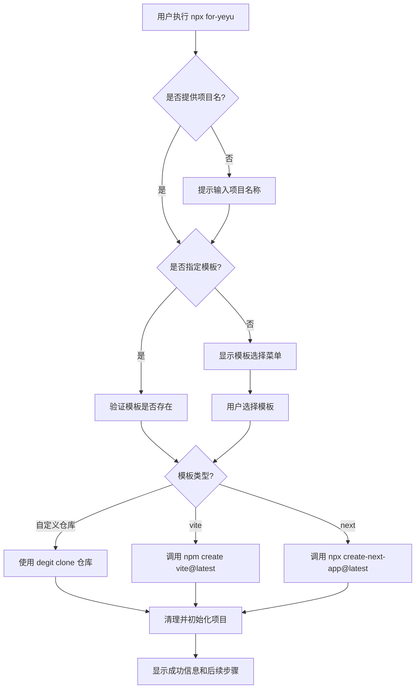

# for-yeyu 脚手架工具设计方案

## 项目概述

`for-yeyu` 是一个命令行脚手架工具，用于快速创建项目。支持：

- Clone 自定义 Git 仓库模板
- 调用 Vite 创建官方模板项目
- 调用 Create-Next-App 创建 Next.js 项目

## 技术栈

- **运行环境**: Node.js >= 18
- **开发语言**: TypeScript
- **核心依赖**:
  - `commander` - 命令行参数解析
  - `inquirer` - 交互式命令行界面
  - `chalk` - 终端颜色输出
  - `ora` - 加载动画
  - `execa` - 执行子进程命令
  - `fs-extra` - 文件系统操作增强
  - `degit` - 快速 clone Git 仓库（不含 .git 历史）

## 使用方式

```bash
# 交互式创建项目
npx for-yeyu

# 快速创建（指定模板）
npx for-yeyu my-project --template nest

# 使用官方工具
npx for-yeyu my-project --template vite
npx for-yeyu my-project --template next
```

## 项目结构

```
for-yeyu/
├── src/
│   ├── index.ts              # CLI 入口
│   ├── cli.ts                # 命令行解析
│   ├── prompts.ts            # 交互式问答
│   ├── templates.ts          # 模板配置
│   ├── actions/
│   │   ├── clone-repo.ts     # Clone Git 仓库
│   │   ├── create-vite.ts    # 调用 Vite
│   │   └── create-next.ts    # 调用 Create-Next-App
│   └── utils/
│       ├── logger.ts         # 日志工具
│       └── spinner.ts        # 加载动画
├── package.json
├── tsconfig.json
└── README.md
```

## 核心流程



## 模板配置

```typescript
// src/templates.ts
export interface Template {
  name: string; // 显示名称
  value: string; // 选择值
  description: string; // 描述
  type: "git" | "vite" | "next"; // 类型
  repo?: string; // Git 仓库地址（type 为 git 时）
}

export const templates: Template[] = [
  {
    name: "NestJS Starter",
    value: "nest",
    description: "NestJS 应用启动模板",
    type: "git",
    repo: "NeilYeTAT/nest-app-starter-for-yeyu",
  },
  {
    name: "EVM DApp Starter",
    value: "evm-dapp",
    description: "EVM DApp 启动模板",
    type: "git",
    repo: "NeilYeTAT/evm-dapp-starter-for-yeyu",
  },
  {
    name: "Vite",
    value: "vite",
    description: "使用 Vite 官方模板创建项目",
    type: "vite",
  },
  {
    name: "Next.js",
    value: "next",
    description: "使用 Create Next App 创建项目",
    type: "next",
  },
];
```

## 交互式界面设计

```
? 请输入项目名称: my-awesome-project

? 请选择项目模板:
  ❯ NestJS Starter      - NestJS 应用启动模板
    EVM DApp Starter    - EVM DApp 启动模板
    ──────────────────────────────────────
    Vite                - 使用 Vite 官方模板创建项目
    Next.js             - 使用 Create Next App 创建项目

✔ 正在创建项目...

🎉 项目创建成功！

  cd my-awesome-project
  pnpm install
  pnpm dev
```

## 核心模块说明

### 1. CLI 入口 (src/index.ts)

```typescript
#!/usr/bin/env node
import { run } from "./cli";
run();
```

### 2. 命令行解析 (src/cli.ts)

- 解析命令行参数（项目名、模板等）
- 未提供参数时进入交互模式
- 提供 `--help` 和 `--version` 选项

### 3. Clone 仓库 (src/actions/clone-repo.ts)

使用 `degit` 库快速 clone 仓库：

- 不包含 `.git` 历史记录
- 支持 GitHub 短链接格式
- 自动处理错误情况

### 4. 调用官方工具 (src/actions/create-vite.ts, create-next.ts)

使用 `execa` 执行官方 CLI 命令：

- Vite: `npm create vite@latest <project-name>`
- Next: `npx create-next-app@latest <project-name>`
- 支持交互式模式透传

## package.json 配置

```json
{
  "name": "for-yeyu",
  "version": "1.0.0",
  "description": "A CLI tool to scaffold projects from templates",
  "type": "module",
  "bin": {
    "for-yeyu": "./dist/index.js"
  },
  "scripts": {
    "build": "tsup src/index.ts --format esm --dts",
    "dev": "tsup src/index.ts --format esm --watch",
    "start": "node dist/index.js"
  },
  "keywords": ["cli", "scaffold", "template"],
  "author": "yeyu",
  "license": "MIT",
  "dependencies": {
    "chalk": "^5.3.0",
    "commander": "^12.0.0",
    "degit": "^2.8.4",
    "execa": "^8.0.1",
    "fs-extra": "^11.2.0",
    "inquirer": "^9.2.12",
    "ora": "^8.0.1"
  },
  "devDependencies": {
    "@types/fs-extra": "^11.0.4",
    "@types/inquirer": "^9.0.7",
    "@types/node": "^20.11.0",
    "tsup": "^8.0.1",
    "typescript": "^5.3.3"
  },
  "engines": {
    "node": ">=18"
  }
}
```

## 扩展性设计

### 添加新模板

只需在 `src/templates.ts` 中添加新的模板配置：

```typescript
{
  name: 'Vue Starter',
  value: 'vue',
  description: 'Vue 应用启动模板',
  type: 'git',
  repo: 'username/vue-starter-template'
}
```

### 未来可扩展功能

1. **配置文件支持**: 支持本地 `.for-yeyu.json` 配置文件，用户可自定义模板列表
2. **模板缓存**: 缓存已下载的模板，加速创建速度
3. **模板更新检查**: 检查模板是否有更新
4. **自定义变量替换**: 在 clone 后替换模板中的占位符

## 实现计划

1. ✅ 需求分析和架构设计
2. 创建项目基础结构
3. 实现 CLI 入口和命令行解析
4. 实现模板配置模块
5. 实现 Git 仓库 clone 功能
6. 实现 Vite/Next.js 集成
7. 实现交互式界面
8. 测试和调试
9. 编写文档
